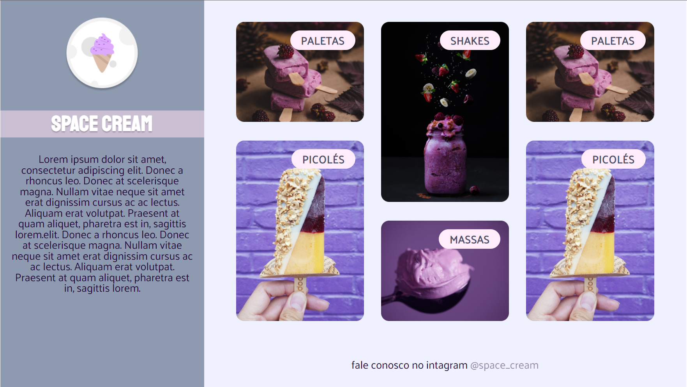

# Rocketseat Explorer - Stage 03 Projeto Solo

Projeto de uma página fictícia de uma sorveteria.

Projeto desenvolvido utilizando conceitos de Grid e variáveis. 

[Clique aqui para acessar](https://buucocs.github.io/expl-stg3-mdl3-projeto2_solo/)

## Tecnologias

- HTML
- CSS
- Git e Github

## Contato

- contato@leonardohgomes.com.br
- @leonardohgomes_
- https://github.com/Buucocs